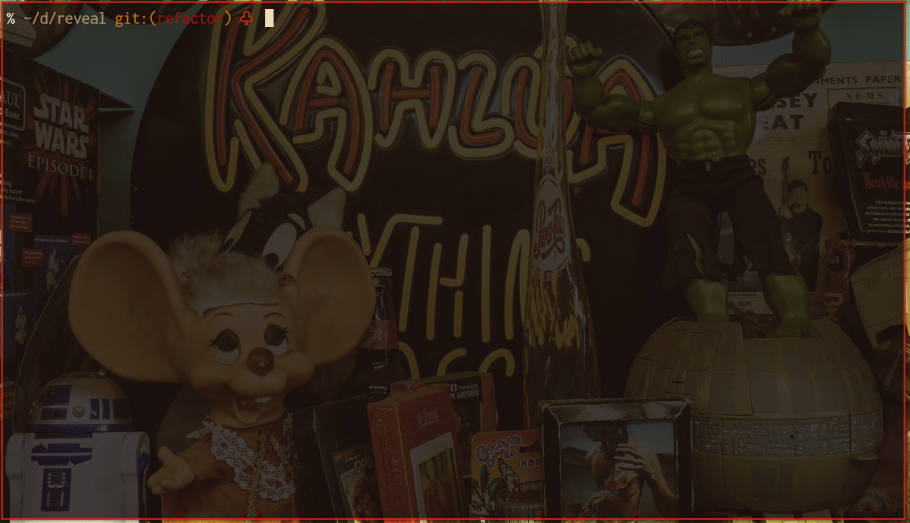

# Reveal

## Starting Point

The Reveal project is terminal utility for Unix-like operating systems that
reveals information about entries in the file system. It was designed to work
perfectly with scripting tools, such as Shell scripting.



## Dependencies

You need to install the following dependencies before installing it:

-   `git`.

    This is the terminal utility tool that will be used to download the
    source code.

-   `clang` and `make`.

    These are the terminal utility tool that will be used to compile the source
    code.

## Installation

-   Clone this repository.

```bash
git clone --depth=1 https://github.com/skippyr/reveal
```

-   Access the repository's directory.

```bash
cd reveal
```

-   Use `make` to compile the source code.

```bash
make
```

-   Add the binary `reveal` created in a directory tracked in your system's
    `${PATH}` variable.

-   Reopen your terminal emulator.

After doing these steps, the program should now be installed.

## Usage

### First Uses

Reveal expects the paths of entries of your file system. By default, it will
reveal its contents. For example: you can make it reveal the contents of your
current directory:

```bash
reveal .
```

Or you can make it reveal the contents of a file:

```bash
reveal foo.txt
```

Or even both:

```bash
reveal . foo.txt
```

### Mode Flags

You can change what type of information to retrive from your entries by
changing the mode Reveal is operating using mode flags.

For example, you can make it reveal the size in bytes of a file.

```bash
reveal --size foo.txt
```

You can also request for multiple data types of multiple entries at once:

```bash
reveal --size foo.txt ~ --permission / --owner-uid ~
```

### Transpassing Flags

By default, Reveal does not follows symlinks. To change this behavior, you
can use the `--transpass` flag. For example:

```bash
reveal --transpass --size link.txt --human-permissions link.txt
```

This flag will also affect when revealing directories: if set, it will resolve
the path of symlink entries.

You can counter this flag using `--untranspass` flag.

### Help

For a list of description and flags for the program, check out its help page:

```bash
reveal --help
```

## Extensions

Reveal's output is very simple, but that is the perfect format for you to extend
it by using other commands available in your system. Like this, there is no
limit of what you can do.

If you are using a POSIX-compliant shell such as Bash or ZSH you can take
advantage of some scripts I have made to extend Reveal's capabilities.
Those are called "extensions" and you can find them under the `extensions`
directory.

Check out these examples:

-   The `reveal-nf` extension adds Nerd Font icons when revealing
    directories:


As you would probably expect, you will only be able to see the icons if you
have a font patched by the [Nerd Fonts](https://github.com/ryanoasis/nerd-fonts/releases)
project installed.

-   The `reveal-tree` extension adds tree view format when revealing a
    directory.


-   The `reveal-ls` extension adds back the format that `ls` uses by default.


-   The `reveal-stat` extension formats the metadata of the entries, similarly
    to the `stat` command.


To use them, simple use a source command on the file. You can use this as
a template:

```bash
source extensions/<EXTENSION>
```

Where `<EXTENSION>` must be replaced by the name of an extension file.

Each extension will add a new function to your current shell section that you
can use just like any other command. Read the extension file to understand what
each of them do.

To make extensions persistent, source them in your shell's startup file.

Along with the ones that come bundled with the source code, you can also
create and share your own extensions.

## Issues And Contributions

Learn how to report issues and contribute to this project by reading its
[contributions guidelines](https://skippyr.github.io/materials/pages/contributions_guidelines.html).

## License

This project is released under the terms of the MIT license. A copy of the
license is bundled with the source code.

Copyright (c) 2023, Sherman Rofeman. MIT license.
